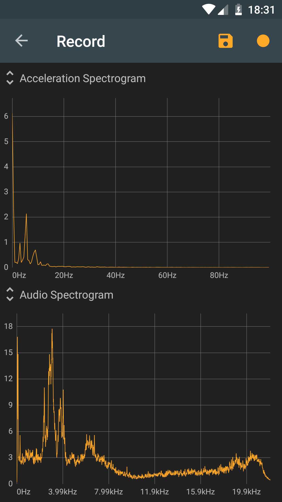
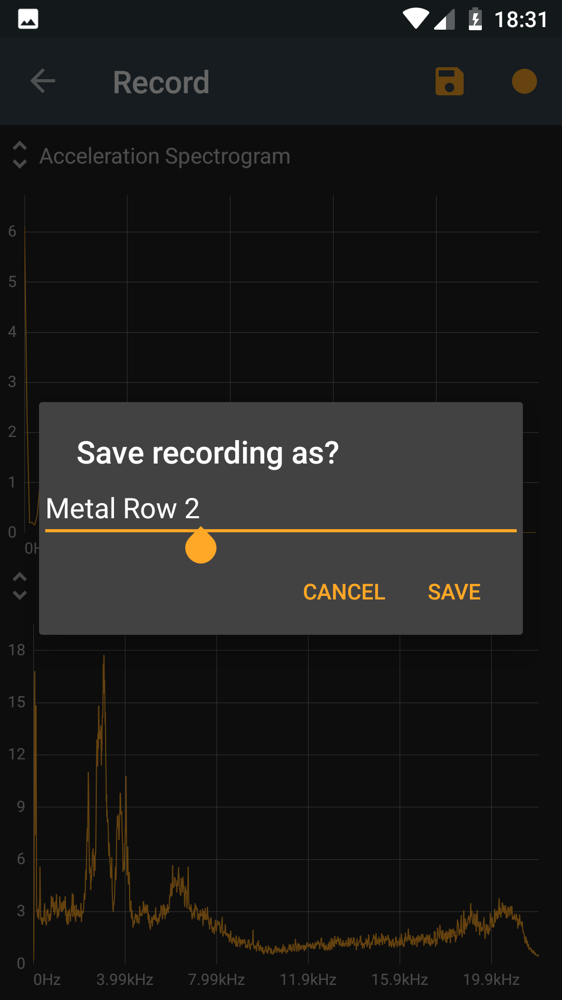
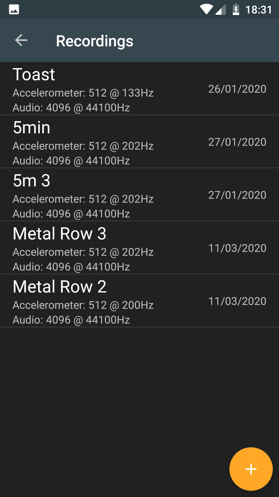
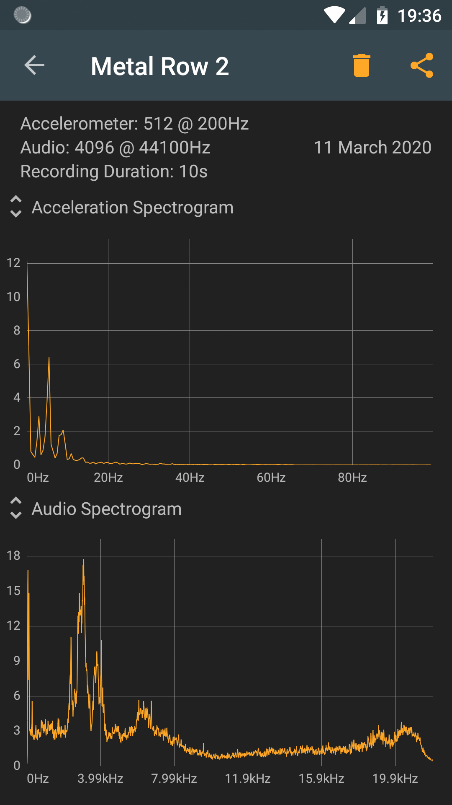
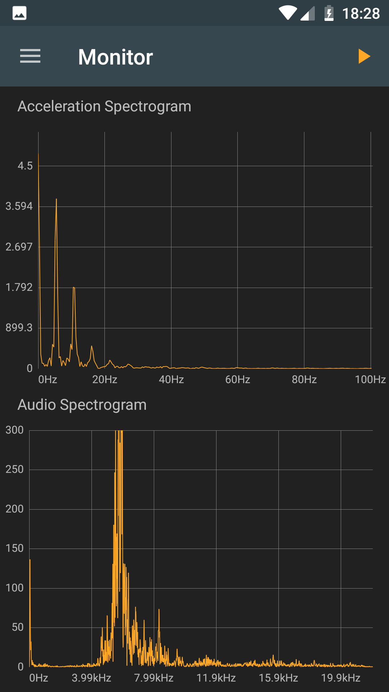

## Basic Usage
### 1. Record normal behaviour
In the recording-fragment, the mean frequency amplitudes for both Acceleration and Audio can be recorded over a configurable length of time.
These can then be stored into a database. 

### 2. Select a recording that will be compared against
The recording-list-fragment shows a list of all saved recordings. 
Clicking on a recording opens a new fragment with more detailed information about it. 
In the future, one recording can be selected from the list as a reference for the normal behaviour of the machine. 

### 3. Monitor machine
The monitor-fragment continuously creates a spectrogram for both acceleration and audio.
In the future, the resulting amplitudes are then compared to the selected normal behaviour of the machine. 
An alarm notify the user of any anomalies 
